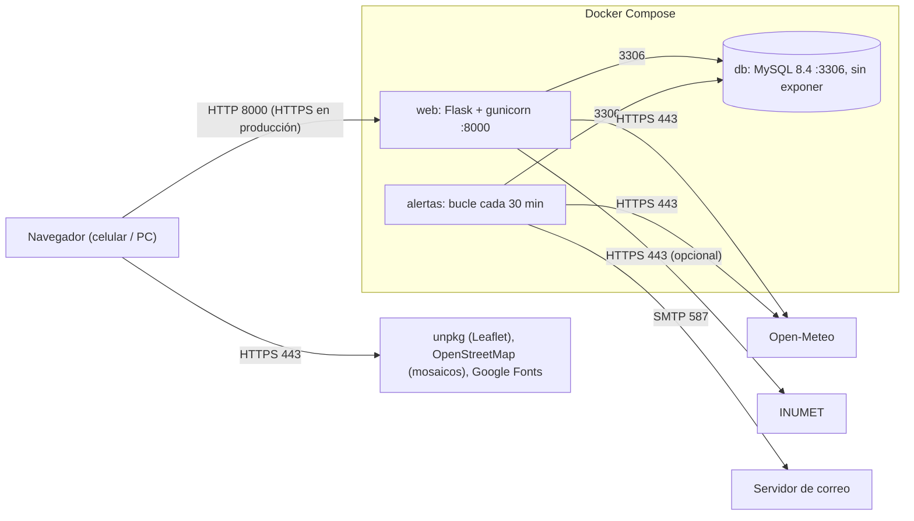

# Requisitos funcionales

| ID | Requisito | Criterio de aceptación |
|----|-----------|------------------------|
| RF-01 | Registro de usuarios | Con nombre, email válido y contraseña de 8 a 128 caracteres se crea la cuenta; un email repetido es rechazado con un aviso. |
| RF-02 | Inicio y cierre de sesión | Con credenciales correctas se accede al mapa; el cierre de sesión borra la sesión. Tras 5 intentos fallidos con un mismo email se bloquea 15 minutos. |
| RF-03 | Selección de zona | El usuario elige departamento y barrio, y su zona queda guardada y precargada en el mapa la próxima vez. |
| RF-04 | Información meteorológica | Por departamento se obtiene la lluvia de los últimos 3 días y el pronóstico (mm y probabilidad) de los próximos 3 días. |
| RF-05 | Análisis del terreno | Cada barrio puede tener altitud y distancia al curso de agua; si faltan, se usa un valor neutro (0,5) y se avisa en pantalla. |
| RF-06 | Cálculo del riesgo | Probabilidad 0–100 % = 55 % lluvia ponderada (pasada 40 %, prevista 60 %) + 15 % probabilidad de precipitación + 30 % terreno. |
| RF-07 | Visualización en mapa | Cada barrio se dibuja con color según nivel: verde (<25 %), amarillo (25–49 %), naranja (50–74 %), rojo (≥75 %). |
| RF-08 | Configuración de alertas | El usuario elige barrios y un umbral entre 10 % y 90 % (máx. 20 barrios), y puede activar o desactivar el email. |
| RF-09 | Envío de alertas | Cuando el riesgo de un barrio seguido supera el umbral se genera una notificación en la bandeja y, si hay SMTP configurado, un email. No se repite el aviso salvo que el nivel empeore o pasen 24 h. |
| RF-10 | Historial de inundaciones | Se consulta por barrio, ordenado por fecha descendente. |
| RF-11 | Administración | Solo el rol admin carga eventos al historial (barrio existente, fecha AAAA-MM-DD no futura). |
| RF-12 | Información preventiva | La página de inicio muestra recomendaciones para antes, durante y después de una inundación. |

Pendiente (fuera de esta versión): gestión del perfil (cambiar nombre, email o contraseña).

# Requisitos no funcionales

| ID | Requisito | Métrica |
|----|-----------|---------|
| RNF-01 | Rendimiento | El mapa de un departamento responde en menos de 3 s con clima en caché y menos de 8 s sin caché. |
| RNF-02 | Actualización de datos | El clima se refresca cada 30 minutos (caché); las alertas se evalúan cada 30 minutos (configurable). |
| RNF-03 | Seguridad | Contraseñas con hash, consultas parametrizadas, protección CSRF en todo POST, cookie HttpOnly/SameSite y opción Secure, límite de intentos de login. |
| RNF-04 | Privacidad | Solo se guardan nombre, email y barrio; nada se comparte con terceros. Los servicios externos solo reciben coordenadas de la capital departamental. |
| RNF-05 | Disponibilidad | Si falla el proveedor de clima, la API responde 502 con un mensaje claro; si falla la base de datos, 503 sin exponer detalles. |
| RNF-06 | Usabilidad y accesibilidad | Tipografía legible (Atkinson Hyperlegible), modo oscuro, foco visible, etiquetas ARIA y mapa operable también desde una lista con teclado. |
| RNF-07 | Compatibilidad | Diseño adaptable desde 360 px de ancho (celular) hasta escritorio; navegadores actuales. |
| RNF-08 | Precisión | El riesgo es una estimación orientativa, no un aviso oficial; esto se aclara en las alertas. |
| RNF-09 | Portabilidad | Todo se levanta con `docker compose up` y variables en `.env`. |

# Stack tecnológico

| Capa | Tecnología | Para qué se usa |
|------|-----------|-----------------|
| Backend | Python 3.12 + Flask 3 | Lógica, rutas, sesiones y plantillas. |
| Servidor de aplicación | gunicorn | Sirve Flask en el puerto 8000 (dentro de Docker). |
| Base de datos | MySQL 8.4 (`mysql-connector-python`) | Usuarios, barrios, suscripciones, notificaciones e historial. |
| Frontend | HTML, CSS y JavaScript (plantillas Jinja2) | Interfaz, modo oscuro y llamadas a la API interna. |
| Mapa | Leaflet 1.9 + mosaicos de OpenStreetMap | Mapa interactivo con los barrios coloreados por riesgo. |
| Clima (pronóstico y lluvia pasada) | API Open-Meteo (por defecto) | Datos sin clave para desarrollo. |
| Clima (lluvia observada) | API de INUMET (opcional, `PROVEEDOR_CLIMA=inumet`) | Reemplaza la lluvia pasada por la observada en la estación más cercana; el pronóstico sigue viniendo de Open-Meteo. |
| Correo | SMTP (`smtplib`, librería estándar) | Envío de alertas por email. |
| Despliegue | Docker y Docker Compose | Servicios `db`, `web` y `alertas`. |
| Tipografías | Google Fonts | DM Sans y Atkinson Hyperlegible. |

# Casos de uso
### Actores

- **Usuario:** se registra, inicia sesión, indica su ubicación, consulta el riesgo y configura las notificaciones.
- **Sistema:** procesa la información climática, calcula el riesgo y muestra los resultados.
- **Servicio de alertas:** proceso periódico que evalúa las suscripciones y envía los avisos.
- **API de clima (Open-Meteo / INUMET):** proporciona los datos de lluvia.
- **API de mapas (Leaflet / OpenStreetMap):** proporciona el mapa base.
- **Servidor de correo (SMTP):** entrega los emails de alerta.
- **Administrador:** carga eventos en el historial.

```mermaid
flowchart LR
  U([Usuario]) --- CU01[CU01 Registrarse]
  U --- CU02[CU02 Iniciar sesión]
  U --- CU03[CU03 Seleccionar ubicación]
  U --- CU05[CU05 Consultar riesgo]
  U --- CU06[CU06 Ver riesgo en mapa]
  U --- CU07[CU07 Configurar alertas]
  U --- CU08[CU08 Elegir lugares a seguir]
  S([Servicio de alertas]) --- CU09[CU09 Enviar notificaciones]
  A([Administrador]) --- CU10[CU10 Cargar historial]
  CU05 -. include .-> CU04[CU04 Calcular riesgo]
  CU06 -. include .-> CU05
  CU09 -. include .-> CU04
  CU04 --- API([API de clima])
  CU06 --- MAP([API de mapas])
  CU09 --- SMTP([Servidor SMTP])
```

| Nº | Caso de uso | Descripción |
|----|-------------|-------------|
| CU01 | Registrar usuario | El usuario crea una cuenta ingresando sus datos. |
| CU02 | Iniciar sesión | El usuario ingresa sus credenciales para acceder al sistema. |
| CU03 | Seleccionar ubicación | El usuario selecciona el departamento y el barrio donde vive. |
| CU04 | Calcular riesgo | El sistema obtiene datos climáticos, los cruza con el terreno del barrio y calcula la probabilidad. |
| CU05 | Consultar riesgo de inundación | El usuario ve el nivel de riesgo de cada barrio de un departamento. |
| CU06 | Visualizar riesgo en mapa | Mapa con colores: verde, amarillo, naranja y rojo. |
| CU07 | Configurar notificaciones | El usuario decide si quiere recibir emails de alerta. |
| CU08 | Seleccionar lugares para notificaciones | El usuario elige barrios y umbral de aviso. |
| CU09 | Recibir notificaciones | El sistema avisa cuando el riesgo supera el umbral configurado. |
| CU10 | Cargar historial | El administrador registra una inundación pasada en un barrio. |

### CU01 – Registrar usuario
- **Actor:** Usuario. **Precondición:** no tener sesión iniciada.
- **Flujo principal:** 1) Abre «Registrarse». 2) Ingresa nombre, email y contraseña. 3) El sistema valida los datos. 4) Crea la cuenta y muestra un mensaje. 5) Lo lleva al inicio de sesión.
- **Flujo alternativo:** datos inválidos o email ya registrado → se muestra el aviso y el formulario queda abierto.
- **Postcondición:** existe un usuario con rol «usuario» y contraseña guardada con hash.

### CU02 – Iniciar sesión
- **Actor:** Usuario. **Precondición:** tener una cuenta.
- **Flujo principal:** 1) Ingresa email y contraseña. 2) El sistema verifica. 3) Abre la sesión y muestra el mapa.
- **Flujo alternativo:** credenciales incorrectas → aviso genérico; tras 5 fallos seguidos con el mismo email → bloqueo de 15 minutos (error 429).
- **Postcondición:** sesión activa con cookie HttpOnly.

### CU05/CU06 – Consultar y visualizar el riesgo
- **Actor:** Usuario. **Precondición:** sesión iniciada.
- **Flujo principal:** 1) Elige un departamento. 2) El sistema obtiene el clima (caché de 30 min) y calcula el riesgo de cada barrio. 3) Muestra círculos de color en el mapa y una lista con porcentaje y nivel. 4) El usuario toca un barrio y ve el detalle.
- **Flujo alternativo:** el proveedor de clima no responde → mensaje «No pudimos obtener el pronóstico» (502).
- **Postcondición:** el usuario conoce el riesgo estimado; no se modifica ningún dato.

### CU08/CU09 – Configurar y recibir notificaciones
- **Actores:** Usuario, Servicio de alertas, Servidor SMTP. **Precondición:** sesión iniciada.
- **Flujo principal:** 1) En «Alertas» el usuario elige departamento, barrio y umbral. 2) El sistema guarda la suscripción. 3) Cada 30 min el servicio calcula el riesgo de los barrios suscriptos. 4) Si supera el umbral y corresponde avisar, guarda la notificación en la bandeja y envía el email. 5) El usuario la ve en «Alertas».
- **Flujo alternativo:** sin SMTP configurado o con el email desactivado → solo bandeja; falla el clima → se omite ese departamento hasta la próxima vuelta.
- **Postcondición:** notificación registrada; el último aviso queda guardado para no repetirlo.

# Diagrama de infraestructura

